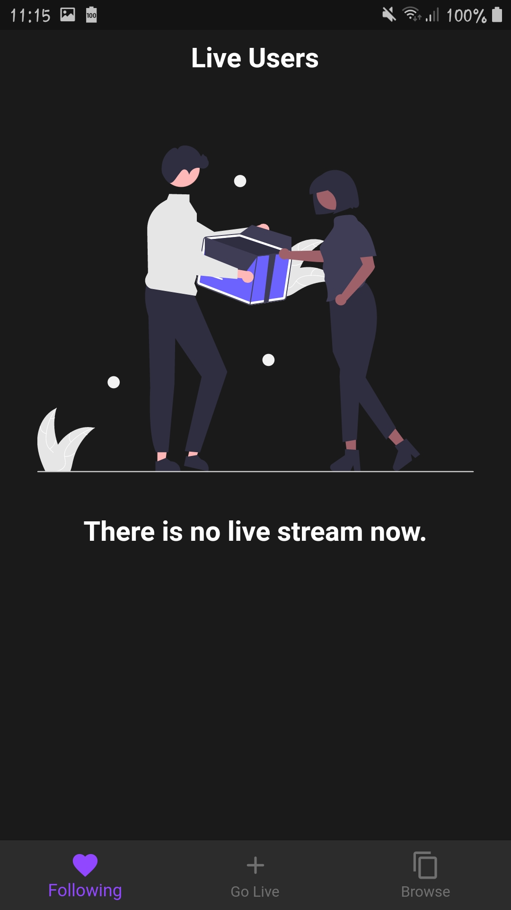

# twitch_clone

> This project is powered by FLutter **3.0.5** and dart **2.17.6**.

The main packages used in the project:

```yaml
cupertino_icons: ^1.0.2
flutter_screenutil: ^5.5.4
flutter_svg: ^1.1.5
firebase_core: ^1.23.0
firebase_auth: ^3.10.0
cloud_firestore: ^3.4.9
firebase_storage: ^10.3.9
flutter_bloc: ^8.1.1
shared_preferences: ^2.0.15
dotted_border: ^2.0.0+2
image_picker: ^0.8.6
agora_rtc_engine: ^5.3.1
permission_handler: ^10.1.0
uuid: ^3.0.6
http: ^0.13.5
timeago: ^3.3.0
intl: ^0.17.0
```

# Screenshots:

<h3> 1- OnBoarding screen </h3>

<p align="center">
  
</p>

<h3> 2- Register screen </h3>

<p align="center">
  
</p>
<h3> 3- Login screen </h3>

<p align="center">
  
</p>
<h3> 4- Home screen When there is no data </h3>

<p align="center">
  
</p>
<h3> 5- Home screen </h3>

<p align="center">
  
</p>
<h3> 6- Live screen </h3>

<p align="center">
  
</p>
<h3> 7- Live screen </h3>

<p align="center">
  
</p>
<h3> 8- Live screen </h3>

<p align="center">
  
</p>
<h3> 10- Live screen With Web and using share screen  </h3>

<p align="center">
  
</p>

## Getting Started

This project is a starting point for a Flutter application.

A few resources to get you started if this is your first Flutter project:

- [Lab: Write your first Flutter app](https://docs.flutter.dev/get-started/codelab)
- [Cookbook: Useful Flutter samples](https://docs.flutter.dev/cookbook)

For help getting started with Flutter development, view the
[online documentation](https://docs.flutter.dev/), which offers tutorials,
samples, guidance on mobile development, and a full API reference.
